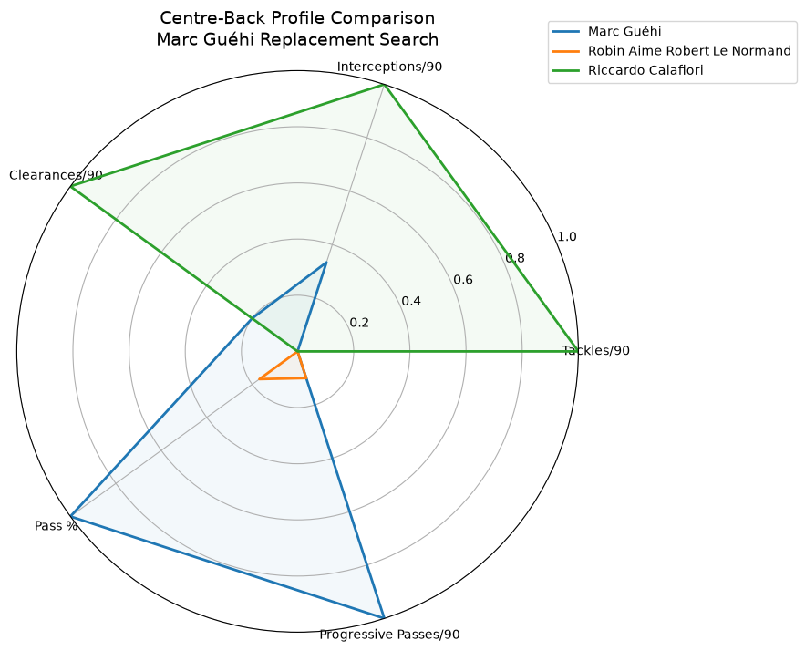

\# Centre-Back Scouting Case Study — Euro 2024

\## Overview

This project replicates a professional football recruitment workflow: identifying potential replacement candidates for a key centre-back using event data and statistical similarity modelling.

The scouting question:

> "If Marc Guéhi became unavailable, which defenders at Euro 2024 present a similar profile?"

The objective was not to find the "best" defender, but to identify players with comparable playing characteristics who could represent realistic recruitment targets.

\---

## Example Output

The project produces statistical player comparisons and recruitment recommendations.

\# Scouting Workflow

The analysis follows a data-driven scouting pipeline:

1\. \*\*Data collection\*\*

&#x20;  - StatsBomb Open Data

&#x20;  - UEFA Euro 2024 match events and lineups

2\. \*\*Player identification\*\*

&#x20;  - Centre-backs selected from tournament lineups

3\. \*\*Metric creation\*\*

&#x20;  - Defensive actions

&#x20;  - Passing contribution

&#x20;  - Progressive distribution

4\. \*\*Normalisation\*\*

&#x20;  - Per 90 minute statistics

5\. \*\*Similarity modelling\*\*

&#x20;  - Statistical distance calculation

&#x20;  - Comparison against Marc Guéhi's profile

6\. \*\*Scouting report generation\*\*

&#x20;  - Automated PDF report

&#x20;  - Player comparison visualisation

\---

\# Data \& Metrics

The model evaluates centre-backs using:

\### Defensive metrics

\- Tackles per 90

\- Interceptions per 90

\- Clearances per 90

\### Ball progression metrics

\- Pass completion %

\- Progressive passes per 90

\### Availability filter

\- Minimum 270 minutes played

\---

\# Key Finding

The model identified the following players as the closest statistical profiles to Marc Guéhi:

| Player | Team | Profile similarity |

|---|---|---|

| Robin Le Normand | Spain | Closest statistical match |

| Jan Vertonghen | Belgium | Similar defensive and passing profile |

| Riccardo Calafiori | Italy | Similar progressive profile |

| Wout Faes | Belgium | Comparable defensive output |

These players represent different scouting options depending on recruitment priorities:

\- immediate defensive reliability

\- ball progression

\- experience

\- tactical similarity

\---

\# Player Comparison

The radar chart compares Marc Guéhi's statistical profile with the closest centre-back matches identified by the similarity model.

The visualisation highlights differences in:
- defensive activity
- ball retention
- progression ability

\---

\# Final Scouting Report

A full written scouting report is available here:

[Open PDF scouting report](report/scouting_report.pdf)

\---

\# Technical Implementation

Built with:

\- Python

\- Pandas

\- StatsBomb event data

\- Scikit-learn

\- Matplotlib

Project structure:

centre-back-scouting-case-study/

├── data/

│ └── Match events and lineup data

├── scripts/

│ ├── 01\_fetch\_data.py

│ ├── 02\_compute\_metrics\_v2.py

│ ├── 03\_find\_replacements.py

│ └── 04\_radar\_chart.py

├── visuals/

│ └── RadarChart.png

├── report/

│ ├── scouting\_report.md

│ ├── scouting\_report.html

│ └── scouting\_report.pdf

└── README.md

\---

\# Skills Demonstrated

\- Football scouting methodology

\- Recruitment analytics

\- Event data processing

\- Player profiling

\- Similarity modelling

\- Data visualisation

\- Automated reporting

\---

\# Conclusion

This project demonstrates how football data can support recruitment decisions by transforming event-level match information into actionable scouting insights.

